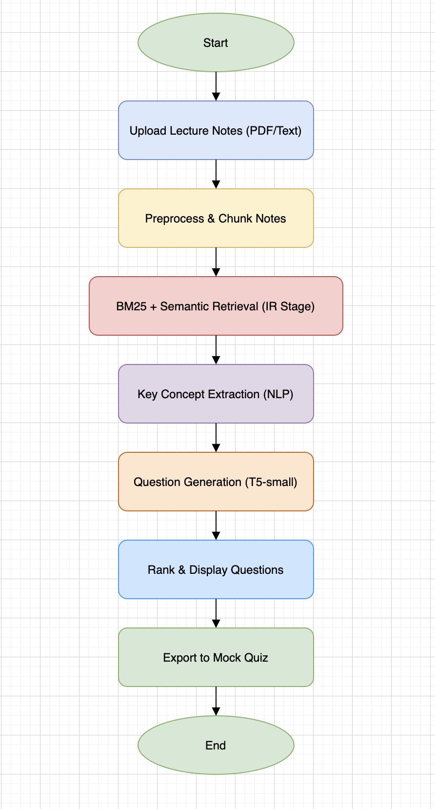

# StudyMate: Automated Exam Question Generator



Turn your lecture notes (PDF/TXT) into exam‑style questions using **IR + NLP**.

## 🚀 Features
- PDF/TXT ingestion → cleaning & chunking
- **Hybrid retrieval**: BM25 (keyword) + Sentence-BERT embeddings (semantic)
- Key concept extraction (spaCy)
- Question generation:
  - Preferred: **T5‑small** via `transformers` (prompted QG)
  - Fallback: robust **template** generator from detected concepts
- Streamlit web app to upload notes, search, generate, and **export** questions (CSV/JSON)

## 📁 Repo Structure
```
studymate/
  app/streamlit_app.py          # Streamlit UI
  config.yaml                   # Tunables
  requirements.txt
  constraints.txt
  scripts/
    ingest.py                   # PDF/TXT -> chunks.csv
    index_local.py              # Build hybrid index (BM25 + embeddings)
    search.py                   # CLI search over the index
    generate_questions.py       # Create questions from top-N chunks
    export_quiz.py              # Save CSV/MD quiz
  sm/
    utils.py, ir.py, nlp.py     # Core logic
  data/
    raw/ processed/ index/      # Storage
  docs/flowchart.png
  evaluation/
```

## 🧰 Setup
```bash
# 1) Create & activate a virtual env (example for macOS/Linux)
python -m venv .venv
source .venv/bin/activate

# 2) Install deps
pip install -r requirements.txt
# (Optional) If you hit platform issues, pin versions in constraints.txt and pass: 
# pip install -r requirements.txt -c constraints.txt

# 3) (Optional) Download spaCy model
python -m spacy download en_core_web_sm
```

## ✨ Quick Start (CLI)
# 0) deps (with FAISS pinned)
printf "faiss-cpu==1.7.4\n" > constraints.txt
pip install -r requirements.txt -c constraints.txt

# 1) ingest
python scripts/ingest.py --input "data/raw/*.pdf" --output data/processed/chunks.csv

# 2) index
python scripts/index_local.py --data data/processed/chunks.csv --index-dir data/index
# Expect: Built hybrid index for N chunks -> data/index/hybrid.pkl

# 3) search (CLI)
python scripts/search.py -q "topic A vs topic B" -k 5

# 4) QG from index (CLI)
python scripts/qg_from_index.py --query "graph traversal vs shortest path" --topn 5 --per-chunk 2

# 5) app
streamlit run app/streamlit_app.py

Upload a PDF/TXT, (optionally) type a focus query, generate, and download your quiz.

## ⚙️ Configuration
Edit `config.yaml`:
- `ir.chunk_size`, `chunk_overlap`
- `ir.alpha_bm25` (0 → embeddings only, 1 → BM25 only)
- `qg.use_transformers` and `qg.model_name` (falls back to templates if loading fails)

## 🔍 How It Works
1. **Ingest**: Parse PDF/TXT → clean → chunk.
2. **Index**: BM25 over tokens + MiniLM embeddings in FAISS.
3. **Retrieve**: Hybrid score = α·BM25 + (1−α)·cosine.
4. **NLP**: spaCy finds entities/noun-chunks → key terms.
5. **QG**: Try T5‑small with a light prompt; if missing, emit high‑quality template questions (definition, compare, explain).
6. **Export**: CSV / JSON / Markdown for mock quizzes.

## 🧪 Evaluation (suggested)
- Human rating: clarity, relevance, difficulty (1–5)
- Coverage: fraction of key topics appearing in generated questions
- Retrieval quality: P@5 / MRR using a small labeled set

Folder `evaluation/` is provided for your artifacts (`metrics.csv`, etc.).

## 🗺️ Roadmap
- Fine‑tune a small T5 or FLAN on academic QG
- Multi‑doc indexing + per‑lecture filters
- Deduplicate questions with semantic hashing
- Add answer generation & distractors for MCQs

## 🛟 Troubleshooting
- **Transformers model fails to download** → set `qg.use_transformers: false` to use templates only.
- **FAISS install issues on Windows** → try `faiss-cpu==1.7.4` or skip embeddings (set α=1.0).
- **spaCy model missing** → run `python -m spacy download en_core_web_sm`.

---
Built with ❤️ for fast exam prep.
